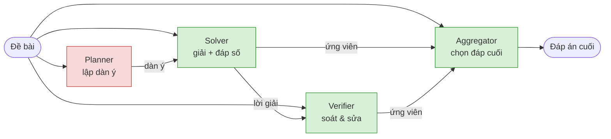

# Đánh giá đóng góp trong hệ suy luận multi-agent LLM: đo lường vai trò dưới ràng buộc SÀN NHIỄU
<sub>Credit Assignment in Multi-Agent LLM Reasoning: Measuring Role Value Against a Measured Noise Floor</sub>

Các mô hình ngôn ngữ ngày càng phối hợp thành nhóm để giải toán, thay vì làm một mình: một *Planner* phác
hướng, *Solver* giải, *Verifier* kiểm tra, *Aggregator* chốt đáp án — và chúng **phối hợp
hoàn toàn bằng ngôn ngữ** — mô hình sau đọc lời giải của mô hình trước rồi viết tiếp. Nhưng giao tiếp là con dao
hai lưỡi: lời của mô hình này có thể sửa lỗi cho mô hình kia, hoặc **làm hỏng một đáp án vốn đã
đúng** (hiện tượng *sycophancy* — mô hình đang đúng lại hùa theo bạn cùng nhóm rồi sửa thành sai).

Xuất phát điểm của dự án là câu hỏi **vai trò nào thực sự đóng góp?**, đo bằng **giá trị Shapley**
trên 2⁴ = 16 tổ hợp vai trò. Nhưng khi mở rộng sang lưới `task × cỡ model` và kiểm chứng bằng
**đăng ký trước (pre-registration)**, chúng tôi gặp một hiện tượng lặp đi lặp lại quan trọng hơn
chính bảng Shapley ban đầu:

> ### Hướng chính hiện tại (ĐÃ SỬA sau khi đo sàn nhiễu)
> **Hiệu ứng của các cơ chế phối hợp đa tác tử PHỤ THUỘC MẠNH vào task và cỡ model — và phần lớn
> KHÔNG ĐO ĐƯỢC một cách đáng tin ở quy mô thí nghiệm thông thường.**
>
> Chúng tôi đo **sàn nhiễu** bằng cách chạy CÙNG cấu hình trên 5 fold rời nhau: giá trị của
> Verifier trải từ **+1.0 đến +8.0 điểm**. Ngưỡng ý nghĩa suy ra là **~5 điểm**. Áp ngưỡng đó
> vào chính các kết quả của mình:
>
> | Khẳng định | Số liệu | Kết cục |
> |---|---|---|
> | Pipeline đa tác tử > Solver đơn (GSM8K) | +5.6đ, [+4,+8], **5/5 fold** | ✅ ĐỨNG |
> | Verifier có giá trị (GSM8K 1.5B) | +4.4đ, [+1,+8], **5/5 fold** | ✅ ĐỨNG |
> | Aggregator gây hại (MATH 1.5B) | −6.4đ, [−9,−4], **5/5 fold** | ✅ ĐỨNG |
> | Verifier có giá trị (MATH 1.5B) | +1.4đ, [−1,+4] | ❌ CHƯA XÁC LẬP |
> | **"Truyền trace đảo dấu 16.6đ giữa 2 task"** | GSM8K [−10,−2] vs MATH [−6,+4] **CHỒNG LẤN** | ❌ **ĐÃ HẠ CẤP** |
>
> **Lợi ích của Verifier được xác lập ở 2/4 ô** — và chúng tạo thành ĐƯỜNG CHÉO:
>
> | `V_gain` | GSM8K | MATH |
> |---|---|---|
> | **1.5B** | **+4.4 [+1,+8]** ✅ 5/5 | +1.4 [−1,+4] ❌ |
> | **7B** | +1.0 [−3,+5] ❌ | **+4.4 [+2,+8]** ✅ 5/5 |
>
> Xếp theo **độ chính xác của Solver** thì cơ chế lộ ra:
> MATH·1.5B `.402` (NGỢP) ❌ · GSM8K·1.5B `.668` ✅ · MATH·7B `.598` ✅ · GSM8K·7B `.884` (BÃO HOÀ) ❌
>
> ### ⇒ VERIFY CHỈ SINH LỢI Ở GIỮA DẢI ĐỘ KHÓ (~.60–.67)
> Quá khó → verifier không phân biệt nổi đúng/sai (**độ chính xác can thiệp chỉ 56%**).
> Quá dễ → không còn gì để sửa. Và giá trị của verifier nằm ở **ĐỘ CHÍNH XÁC KHI CAN THIỆP**,
> không ở số lỗi bắt được: 1.5B đạt **56–71%** (gần như tung đồng xu), 7B đạt **98%** —
> đó chính là cơ chế của kết quả +14.0đ.
>
> ⚠️ **DIỄN GIẢI CỦA "+14.0đ" ĐÃ BỊ RÚT LẠI ở vòng #100 — xem mục ngay dưới.**
> Con số đúng, nhưng nó so với **1.5B**. So với **7B chạy một mình** (rẻ hơn) thì nó **ÂM**.

## ⭐ Kết quả mới nhất (vòng #99–#142) — **ĐÃ QUA KIỂM ĐỊNH ĐỘC LẬP**

> **Mọi con số dưới đây đã qua kiểm định bởi ba tác nhân độc lập (vòng #125)** — kiểm mã nguồn,
> kiểm số liệu bằng McNemar/bootstrap ghép cặp, và kiểm lập luận so với bảng khoá trước.
> **Nhiều kết luận trung gian của chúng tôi KHÔNG sống sót và đã bị rút** (liệt kê ở cuối mục).
> Chỉ những phát biểu có p ≤ 1e-3 và/hoặc tái lập trên tập bài tách rời mới được nêu ở đây.

### 1. Con số ai cũng báo cáo có DẤU NGƯỢC với con số đúng

Khi cho model **mạnh** xem lời giải của model **yếu** rồi kiểm/sửa, hầu hết báo cáo dùng
`V − S` (verifier so với **solver yếu**). Nhưng lựa chọn thay thế thật sự là
**gọi thẳng model mạnh** (`I`) — và nó **RẺ HƠN** (một lượt thay vì hai).

| bộ | cặp model | `V − S` (hay được báo) | **`V − I`** (đúng) | p (McNemar) |
|---|---|---|---|---|
| GSM8K | 0.5B → 1.5B | +.1700 | **−.1040** | — |
| GSM8K | 1.5B → 7B | +.1620 | **−.0740** | 3e-4 |
| MBPP (code) | 1.5B → 7B | +.1380 | **−.0740** | 3e-4 |
| MATH-500 | 1.5B → 7B | — | **−.1260** | 2.7e-10 |

**Bốn lần đo, hai benchmark, ba cặp model — `V − I` ÂM mọi lần.**
Định tuyến sản phẩm của agent yếu vào agent mạnh **tốn thêm tiền để có kết quả TỆ HƠN**.

*Liên hệ tài liệu:* điều này trùng hướng với Huang et al. 2023 (*LLMs Cannot Self-Correct
Reasoning Yet*); đóng góp của chúng tôi là **định lượng khoảng cách `V−S` vs `V−I`** và
tách cơ chế bên dưới, **không phải** phát hiện hiện tượng.

### 2. Cùng hai sản phẩm, cùng chi phí: **CHỌN hơn REVIEW +.13**

| giao thức | acc | so với `I` |
|---|---|---|
| `I` — 7B tự viết | .6400 | — |
| `V_review` — 7B **sửa** code của 1.5B | .5320 | −.1080 |
| **`SEL`** — 7B **chọn** giữa bản của nó và của 1.5B | **.6620** | **+.0220** [+.008, +.038] |

`SEL − V_review` = **+.1300** (p 9e-13), tái lập **+.0841** trên dải bài tách rời (MBPP 511–974).
**Cùng hai bản code, cùng ngân sách — chỉ đổi GIAO THỨC.**

> **Đọc `SEL − I` cho đúng (bắt buộc theo kiểm định #125-D).** Con số **thắng lớn là `SEL − V_review`**,
> không phải `SEL − I`. `SEL − I` chỉ **+.0220** [+.008, +.038] (p .0074), tái lập **+.0151**
> [+.002, +.028] (p .039), gộp Fisher p .0026 — **sát ngay ngưỡng .02 mà chính tài liệu này gọi là
> nhiễu** ở mục rút lại bên dưới. **Lật 6 bài là xoá sạch** hiệu ứng ở H69c. Nói cách khác:
> *tránh REVIEW* là kết luận vững; *giá trị thật của agent yếu* thì **nhỏ và mong manh**.

**Cơ chế (đọc từ trace):** được bảo *"review"*, model **VIẾT LẠI code đang chạy và làm hỏng** —
**78%** thiệt hại trên code là một **bản thứ ba** chứ không phải chép bản sai. Được bảo *"chọn"*,
nó để nguyên bản tốt.

### 3. Nghịch lý phục tùng / chủ động — **không có điểm ngọt ở tầng prompt**
| prompt | acc | vs `I` | cơ chế hỏng |
|---|---|---|---|
| `V_std` "kiểm và sửa nếu sai" | .5660 | −.0740 | viết lại → phá bản đúng |
| `V_first` "tự giải trước rồi mới đọc" | .5880 | −.0520 | tốt nhất đo được, vẫn âm |
| **`V_cons`** "đừng đụng nếu không chắc sai" | **.4840** | **−.1560** | **giữ nguyên 75% → thừa hưởng acc .428 của nguồn** |

Bảo nó **bớt** can thiệp thì nó **thừa hưởng lỗi của nguồn**; bảo nó **can thiệp** thì nó **phá bản đúng**.
Chọn giữa hai cực đòi hỏi biết đâu đúng đâu sai — **chính là bài toán cần giải**.

### 4. Thứ DUY NHẤT từng thắng: **oracle mang thông tin model KHÔNG có**
| bộ kiểm | có lợi thế thông tin gì | kết quả |
|---|---|---|
| 7B kiểm 1.5B | model lớn hơn | **−.074** ❌ |
| LLM cùng cỡ tự nhận xét | không có | ≈0 hoặc hại (5 lần) ❌ |
| GRPO huấn luyện verifier | không có | +.018, dưới ngưỡng ❌ |
| **test CHẠY ĐƯỢC** | **thực thi được** | **+.0401, tái lập +.0388** ✓ |

### 5. **Sửa có CỔNG cũng chết — kể cả cổng HOÀN HẢO** (#142, tái lập 2/2)

Nếu `V` phá vì nó **ghi đè lên bản vốn đã đúng**, thì chặn ghi đè bằng một cổng phải cứu được.
Chúng tôi dựng đúng thí nghiệm đó, gồm cả một **cổng ORACLE** (giữ bản của model yếu khi nó
**thật sự đúng**, sai thì mới cho model mạnh sửa). Không hệ thống nào làm tốt hơn cổng oracle.

| đại lượng | MBPP 11–510 | MBPP 511–974 (dải tách rời) |
|---|---|---|
| **cổng ORACLE so với `I`** | **−.0641** (p .0016) | **−.0583** (p .0067) |
| cổng có cứu được "sửa" không | **+.0040** (p .69) | **+.0000** (p 1.00) |
| leo thang bằng **giải lại** vs bằng **sửa** | **+.0902** (p 1e−6) | **+.0994** (p 1e−6) |

```
cong ORACLE = P(yeu dung) + P(yeu sai VA sua dung) = .4409 + .1363 = .5772
chi goi model manh mot luot                                        = .6413
                                                        thieu       -.0641
```

1. **Cổng không làm gì cả** — null ở cả hai dải. Phá hoại **không nằm** ở chỗ cổng với tới:
   `V` phá 12 bài mà model yếu làm đúng, chỉ **4** bài nằm trong tập cổng-đạt.
2. **Ngay cả cổng hoàn hảo cũng thua** việc chỉ gọi model mạnh ⇒ **không có gì để khai thác**.
   Cải thiện tín hiệu cổng là vô ích — đây là **chặn trên**, và nó âm.
3. **Thiệt hại nằm ở nhánh leo thang:** khi đã quyết định can thiệp, cho model mạnh
   **giải lại từ đầu** hơn cho nó **sửa** khoảng **+.09**. Cùng ngân sách, cùng bài; khác
   **duy nhất** ở chỗ model mạnh **có nhìn thấy** bản của model yếu hay không.

> **Vấn đề không phải model mạnh ĐƯỢC PHÉP ghi đè — mà là nó NHÌN THẤY.**
> Việc nhìn thấy làm hỏng nó **đúng ở những bài model yếu đã sai**, tức đúng chỗ ta cần nó nhất.
> Cổng vô dụng vì cổng điều khiển *ghi đè*, không điều khiển *nhìn thấy*.

*(Đang kiểm: `H92` tách riêng **NHÌN THẤY** khỏi **ĐƯỢC LỆNH SỬA** — mọi phép đo đầu độc trước
nay đều trộn hai thứ. Bảng khoá #102 có sẵn một hàng **giết** chính phát biểu ở trên.)*

### 6. ✅ **Đa dạng HỌ MODEL — kết quả dương DUY NHẤT đã tái lập trên dải tách rời** (#131 + #145)

Giữ **nguyên** bộ chọn và **nguyên** ngân sách; chỉ đổi **nguồn gốc** của các ứng viên.

| | MBPP 11–510 | MBPP 511–974 (**tách rời**) |
|---|---|---|
| **trần `H`**: pool khác họ − pool lấy mẫu | **+.0500** (p 6.2e-4) | **+.0690** (p **9.4e-07**) |
| **`SEL`**: pool khác họ − pool lấy mẫu | **+.0320** (p 7.0e-3) | **+.0453** (p **4.9e-05**) |
| số bài **có bất đồng** | 57 → 167 | 47 → **176** |

**Cơ chế, đo được mà KHÔNG cần chấm điểm:**

| | 3 mẫu từ **CÙNG** model | 3 model **KHÁC HỌ** |
|---|---|---|
| số ứng viên **phân biệt** (trung bình) | **1.91** / 3 | **2.70** / 3 |
| bài chỉ có **MỘT** ứng viên duy nhất | **36.2%** | **6.5%** |

> **Lấy mẫu lại từ cùng một model, 3 lượt, chỉ mua được ~1.9 ứng viên khác nhau —
> và 36% số bài chỉ có ĐÚNG MỘT.** Ở những bài ấy, mọi giao thức "sinh nhiều rồi chọn"
> đều **bất lực về cấu trúc**: không có gì để chọn giữa.
> Dùng ba model **khác họ** đưa con số đó xuống **6.5%**.
> Nói cách khác: phần lớn cái ta gọi là "lỗi tương quan" giữa các mẫu cùng model là dạng
> mạnh nhất có thể — **chúng trả về cùng một chuỗi ký tự**.

**Hệ quả thực dụng:** nếu định trả tiền cho `k` lượt sinh, **k model khác nhau** đáng giá hơn
**k mẫu từ một model** — rẻ ngang nhau, mà trần cao hơn và bộ chọn mới có việc để làm.

### ⚠️ Đã RÚT LẠI sau kiểm định #125 — đừng trích dẫn
- **"k=2 là điểm ngọt"** — độ cong không tồn tại; nhánh k=2 còn dính **thiên lệch chọn mẫu** trong code của chúng tôi.
- **"tự xem lại giúp trên toán +.108"** — **artifact cắt ngắn**; đo lại còn **+.002** (p = 1.00).
- **"agent yếu thua mẫu của chính model mạnh (+.012)"** — **nhiễu hạt giống** (p = .34).
- **"tie_rate giảm theo k"** — đo nhầm sự kiện; đại lượng thật **TĂNG** .908 → .944.
- **"5/5 fold"** — hai chỗ thực ra là **4/5**, và phép thử này yếu hơn McNemar mà chúng tôi chưa chạy.
- Mọi chênh lệch **≤ .02** ở n=500 — **không phân biệt được với nhiễu**.

## Kết quả vòng #78–#93 — 16 đăng ký trước, **5 phát biểu bị rút lại**

Một ngày chạy liên tục trên Kaggle (≈250 kernel). Mỗi phép thử có **bảng diễn giải khoá trước**,
kèm **một hàng cho trường hợp giả thuyết chết**. Kết quả: prior của tôi **đúng 5/12 lần**,
và phần lớn công việc là **thu hẹp** các phát biểu cũ, không phải mở rộng.

### A. ✅ Kết quả DƯƠNG thực dụng **duy nhất**: định tuyến theo đồng thuận, **trên MATH**
Lấy 3 mẫu bằng 1.5B; nếu ≥2 đồng ý thì NHẬN và dừng; nếu không thì gọi 7B chạy **tuần tự có mỏ neo**.

| lần chạy | n | máy | `escalate_seq` vs `big_maj3` | chi phí |
|---|---|---|---|---|
| H39_m | 200 | RTX 5090 (bf16) | **+.140** (5/5 fold) | rẻ hơn **1.63×** |
| H40 | 500 | 20 kernel Kaggle (fp16) | **+.092** | rẻ hơn **1.66×** |

So với `big_maj8`: **+.105 với 4.34× ít tính toán hơn**. Cùng chiều, phần cứng độc lập, mẫu gấp 2.5×.
**Chưa kiểm ở 14B** — đó là phép thử quyết định xem đây là quy tắc hay hiện tượng của model nhỏ.

### B. ❌ Trên **CODE**, điều phối **không bao giờ bù lại được** — 3 lần độc lập
| phép thử | đường ống | bị thua bởi |
|---|---|---|
| định tuyến (#81) | định tuyến oracle + escalate | `big_greedy` .6365, thua **cả acc lẫn chi phí** |
| tự lập kế hoạch (#90) | kế hoạch → giải → tự kiểm | tuần tự thường, −.037 đến −.063 |
| kế hoạch bất đối xứng (#91) | **7B lập kế hoạch → 1.5B giải** | `big_greedy`, **−.140 với +2.00 chi phí** |

> **Cùng ngần ấy tính toán, chạy MỘT LƯỢT model lớn hơn luôn tốt hơn mọi đường ống đã thử.**

### C. 🔄 "Tuần tự thắng song song" — **thu hẹp lại**: chỉ TOÁN, và là **LƯỢT THÊM** chứ không phải mỏ neo
Lưới 4 ô, **không escalate, không hai model** (#85), tái lập độc lập ở #87:

| ô | `greedy` | `delta_seq` = tuần tự − maj3 |
|---|---|---|
| MATH 1.5B | .3367 | **+.0566** |
| **MATH 7B** | **.4900** | **+.1433** |
| GSM8K 1.5B | .6200 | +.0100 |
| **GSM8K 7B** | **.9067** | **−.0100** |

**CÙNG một model 7B cho hai dấu ngược nhau** — biến quyết định là **model đã giỏi tới đâu TRÊN
TÁC VỤ ĐÓ**, không phải bài khó hay dễ (giả thuyết "độ khó" đã **chết** ở #83, ngược hẳn dấu).
**Trên CODE quy tắc này KHÔNG áp dụng**: MBPP 1.5B có `greedy` .456 (xa trần) mà `delta_seq` vẫn **−.022** (#88).

### D. ❌ **Lập kế hoạch không đáng một lượt** — kể cả trên bài dài, với can thiệp đã kiểm chứng
Lần đầu (#89) hỏng: **85–100% "kế hoạch" thực ra là CODE**. Bảo model "đừng viết code" vô dụng.
Chặn dấu rào code ở **tầng sinh** (`bad_words_ids`) hạ tỉ lệ xuống **7.0% / 0.0%** — khi đó (#90):

| ô | `seq` | `PSV` (kế hoạch) | **PSV − seq** |
|---|---|---|---|
| BigCodeBench 1.5B | .1900 | .1267 | **−.0633** |
| BigCodeBench 7B | .3467 | .3100 | **−.0367** |

BigCodeBench dài gấp ~4 lần MBPP (prompt trung vị 607 ký tự, phải ghép nhiều thư viện).
=> Các kết quả null trước đây về Planner **KHÔNG** phải do bộ dữ liệu quá ngắn.

### E. 🔄 Oracle chỉ đáng giá khi **model SỬA NỔI** theo nó
| tác vụ | oracle 3 vòng đáng giá |
|---|---|
| **SINH** code mới (H35) | **+6 đến +11 điểm** |
| **REFACTOR** (#93) | **+1.9 điểm** (dù dùng TB 2.70 vòng) |

Trên refactor, ~26% vẫn làm hỏng hành vi **ngay cả khi có oracle**, và **lượt LLM tự nhận xét làm
TỆ ĐI** (.7116 vs .7378 khi không xem lại) — tái lập ở hai lần chạy.
=> Bổ sung điều kiện cho phát biểu #1: **oracle phải KHU TRÚ được lỗi thì model mới sửa được.**
Lỗi khi sinh code thì thô; lỗi khi refactor là **trôi ngữ nghĩa tinh vi**, stack trace chỉ nêu triệu chứng.

### F. Chất lượng tái lập — hai cặp chặt nhất dự án có
| đại lượng | lần 1 | lần 2 | lệch |
|---|---|---|---|
| lấy mẫu − tuần tự (code, nhóm escalate) | +.1159 | +.1164 | **.0005** |
| `preserve` của refactor có oracle | .7707 | .7715 | **.0008** |

Hai tách dữ liệu rời nhau / hai loạt kernel riêng biệt.

### G. Đã RÚT LẠI trong ngày (chi tiết ở `IDEAS.md`)
1. **"Trần/bão hoà theo ĐỘ KHÓ giải thích được định tuyến"** — chết ở #83, **ngược hẳn dấu**.
2. **"Cơ chế là MỎ NEO"** (vòng #73) — đo trực tiếp: mỏ neo đóng góp **≈0** trên toán (|A−B| ≤ .01
   ở 3/4 ô); cái có tác dụng là **lượt thêm**. Trên code mỏ neo lại **gây hại** (−.08 đến −.10),
   nhưng **chỉ trên nhóm bài khó đã lọc** — trên toàn bộ bài thì ≈0.
3. **"Mỏ neo chiếm 63% thiệt hại trên code"** — tách khác cho **47%**; con số không ổn định, chỉ
   được nói "khoảng một nửa".
4. **`seq − maj3` = +.1266 trên BigCodeBench** — **lỗi thiết kế của tôi**: nhánh `maj3` chọn bằng
   **kết quả test dùng để chấm** (rò rỉ) và là điều kiện "≥2/3 đạt" chứ không phải bỏ phiếu.
5. **"Định tuyến chết trên code"** — nói quá: định tuyến + **lấy mẫu** đạt ngang `big_maj3` với
   **1.82× ít chi phí**; cái chết là định tuyến + **tuần tự**.

### H. Hai thí nghiệm bị **tuyên vô hiệu** bởi chính cổng đã khoá
- **#89**: nhánh `PSV` — can thiệp không xảy ra (kế hoạch chứa code). Script gộp vẫn in ra
  "lập kế hoạch không đáng một lượt"; **cổng can thiệp có quyền cao hơn script**, nên kết luận đó bị bác.
- **#89**: nhánh `maj3` — rò rỉ tín hiệu chấm điểm (mục G.4).

---

## Kết quả vòng #59–#70 (vẫn đứng, trừ mục 3 đã thu hẹp ở trên)

### 1. ✅ BỘ KIỂM ĐÚNG ĐẮN thắng LLM-đi-kiểm — **4 lần chạy độc lập, 0 lần gây hại**
Cùng model, cùng 4 lượt sinh, **chỉ khác NGUỒN TÍN HIỆU KIỂM** (chạy test thật vs LLM tự đọc lại):

| lần chạy | máy | `exec3−llm3` | `exec3−greedy` | **phá đáp án đúng** |
|---|---|---|---|---|
| HumanEval 1.5B | Kaggle T4 | +.119 (5/5) | +.063 | **0.0** / llm3: 2.8 |
| HumanEval 1.5B | RTX 5090 | +.206 (5/5) | +.081 | **0.0** / llm3: 4.6 |
| HumanEval 7B | RTX 5090 | +.100 (4/5) | +.081 | **0.0** / llm3: 2.6 |
| HumanEval 7B | Kaggle | +.156 (5/5) | +.106 | **0.0** / llm3: 3.2 |

> **`exec3` KHÔNG phá một lời giải đúng nào trong 20/20 fold. `llm3` phá trong 20/20 fold.**
> Khác biệt không chỉ ở độ chính xác — mà ở **TÍNH AN TOÀN**.

**Cơ chế**: `exec3` đạt **CHÍNH XÁC** `oracle@4` ở cả hai cỡ model (.6438 và .8812 — khớp tới 4 chữ số).
Bộ kiểm không "sửa giỏi hơn" — nó **CHỌN hoàn hảo**: biến k mẫu thành best-of-k.
Bỏ phiếu chỉ lấy được 43.1% trong khi 64.4% khả dụng -> **bỏ lỡ 21.3 điểm**.

### 2. ✅ "CHẠY ĐƯỢC" ≠ "MÔ HÌNH HOÁ ĐÚNG" — PAL thua ở **5/5 phép đo, cả hai miền**
H8 từng bị tuyên VÔ HIỆU ở 1.5B (`exec_success_rate` .42 < ngưỡng .50). Rào cản đó **đã hết**:

| ô | exec_ok | greedy | maj@3 | **pal3** | pal3 − maj3 |
|---|---|---|---|---|---|
| GSM8K 7B | **.980** | .948 | .944 | .876 | **−.068 (0/5)** |
| GSM8K 1.5B | .872 | .492 | .480 | .436 | **−.044 (1/5)** |
| MATH 7B | .875 | .485 | .540 | .475 | **−.065 (1/5)** |
| MATH 7B (n=250) | .852 | .480 | .508 | .452 | **−.056 (2/5)** |
| MATH 1.5B | .760 | .325 | .370 | .295 | **−.075 (0/5)** |

> **Chương trình CHẠY ĐƯỢC gần như luôn luôn (.98 ở GSM8K 7B). Chúng chỉ tính SAI THỨ CẦN TÍNH.**
> Viết-và-chạy Python **LUÔN THUA** suy luận văn bản: −4.4 đến −7.5 điểm, 5/5 phép đo.

> **Bộ kiểm chỉ có giá trị khi nó là ORACLE VỀ TÍNH ĐÚNG (bộ test), không phải khi nó chỉ là
> MỘT CÁCH TÍNH KHÁC (chạy Python cho toán).** Một chương trình chạy trơn tru vẫn tính sai thứ cần tính.

*(Hệ quả cho chứng minh định lý hình thức: bộ kiểm Lean LÀ oracle -> thuộc nhóm CODE, không phải nhóm này.)*

### 3. 🔄 TUẦN TỰ thắng SONG SONG — **ĐÃ THU HẸP** (xem mục C ở trên: chỉ TOÁN, và cơ chế KHÔNG phải mỏ neo)
Mọi nhánh **đúng 3 lượt sinh**; đếm cả token thực sinh ra:

| ô | greedy | maj@3 | **P→S→V** | `maj3−PSV` |
|---|---|---|---|---|
| GSM8K 1.5B | .632 | .664 | **.728** | −.084 (5/5) ✅ |
| MATH 1.5B | .325 | .385 | **.440** | −.055 (0/5) ✅ |
| MATH 7B | .480 | .515 | **.595** | −.080 (0/5) ✅ |
| GSM8K 7B *(bão hoà .924)* | .924 | **.928** | .912 | +.016 (3/5) ❌ |

`P→S→V` dùng **ít token hơn `maj@3` 22%** mà vẫn hơn 8.4 điểm. Ô duy nhất thua là ô **BÃO HOÀ**
— đã khoá trước là ĐIỀU KIỆN, không phải phản chứng.
**Nhưng cơ chế KHÔNG phải phân vai**: nhánh `S→neo→neo` (không một chữ nào về vai) đạt **.728**,
GIỐNG HỆT `P→S→V`. Cái có tác dụng là **MỎ NEO**, không phải tên vai.
> ⚠️ **RÚT LẠI (#87)**: đo tách riêng cho thấy mỏ neo đóng góp **≈0**. Thứ có tác dụng là **LƯỢT THÊM**.

**Nhiễu loạn đã loại trừ**: đối chứng `maj3_g` (bỏ phiếu CÓ một mẫu greedy) ≈ `maj@3` ở
**7 ô độc lập** (−.025 đến +.016) -> lợi thế KHÔNG đến từ giải mã greedy.

### 4. ✅ KIỂM LỖI phụ thuộc **NĂNG LỰC × MIỀN**, không chỉ năng lực
Tiêm lỗi số học vào chuỗi vàng, phân tầng theo năng lực giải của chính model:

| | 1.5B | 7B |
|---|---|---|
| GSM8K | suy biến .99 → **VÔ HIỆU** | phân biệt **+.651** |
| MATH | suy biến .99 → **VÔ HIỆU** | phân biệt **+.113** (ZERO n=224, đủ lực) |

Cùng model, cùng cách tiêm, cùng prompt — **khác 5.8 lần chỉ vì MIỀN**.
7B kiểm được số học trong chuỗi GSM8K ngắn; KHÔNG kiểm được trong chuỗi LaTeX nhiều bước của MATH.

### 5. 📊 ĐỒNG THUẬN là tín hiệu đúng/sai gần như hoàn hảo — và MIỄN PHÍ
| số mẫu đồng ý (k=8) | GSM8K | MATH |
|---|---|---|
| 8/8 | **1.000** | **1.000** |
| 6/8 | .917 | 1.000 |
| 1/8 (không có đa số) | **.143** | **.000** |
**50–58% số bài KHÔNG có đa số nào** ở k=3 -> `maj@3` thoái hoá thành "lấy mẫu đầu tiên".
Chỉ cần ĐẾM, không cần huấn luyện gì.

---

## ⚠️ TẠM ĐÌNH CHỈ — nhánh "tổng hợp" đang được đo lại (vòng #59–#60)

Rà soát ngày 2026-08-08 phát hiện **lỗi rò rỉ adapter** trong 6/6 kernel có huấn luyện:
mẫu ĐÁNH GIÁ được sinh khi LoRA `Yes/No` vẫn đang BẬT, nên **Solver bị chính bộ chấm làm hỏng**.
Bằng chứng: cùng ô, cùng dữ liệu, chỉ khác lượng huấn luyện (800 vs 1600 bước) ->
`greedy1` .5167 vs **.3867**, `maj@8` .7067 vs **.5467**, và chênh lệch báo cáo +.030 vs **+.110**.

Do đó **H27 (rerank), H28/H28b (bỏ phiếu có trọng số), H31 (oracle_solid)** đang **TẠM ĐÌNH CHỈ** —
không phải đã bác, cũng không phải đã xác nhận. Mọi con số của bốn giả thuyết đó **không được trích dẫn**
cho tới khi bản đã sửa (`disable_adapter` khi sinh lời giải, ngưỡng `adapter_leak <= .05`,
đăng ký trước #36) chạy xong.

So sánh CẶP (`wsum` vs `maj` trên CÙNG 8 mẫu) vẫn hợp lệ về nội tại nên **HƯỚNG** nhiều khả năng
còn đúng; nhưng **ĐỘ LỚN không chuyển được sang thực tế**, vì khi triển khai thật Solver là model GỐC.
Phần còn lại của README (H1, H2, H24, H25, H29, H30, GRPO) **KHÔNG** dùng adapter nên không bị ảnh hưởng.

---

## Cập nhật vòng #43–#49

**Hai phát biểu nữa đã bị rút lại, và có một phát hiện DƯƠNG.**

| Nội dung | Trạng thái |
|---|---|
| "Aggregator LLM là SAI LOẠI, phải thay bằng thống kê" | **RÚT LẠI** — so sánh cũ KHÔNG công bằng (aggregator thiếu chỉ dẫn CoT, 384 vs 1024 token). Chạy lại công bằng ở 7B: đè đa số đúng **26→3**, cứu **0→4**, `vs_maj` **+.008**. Ở 7B **không còn khác biệt đo được**. |
| "Verifier bịt mắt bắt lỗi tốt hơn" (H1) | **KHÔNG KẾT LUẬN CHUNG** — đúng ở 3/4 ô, NGƯỢC ở MATH 7B. Nơi nó sửa nhiều hơn (.457 vs .217, p<.001) thì cũng phá nhiều hơn đúng tỉ lệ (.146 vs .038, p<.001) → giá trị RÒNG không đổi. |
| Khung "hãy kiểm tra" có mang thông tin không? | **KHÔNG** (3/4 ô). Nhánh `S_anc` — chỉ nói *"lần trước trả lời X"*, không có một chữ nào về kiểm tra — ngang hoặc hơn verifier bịt mắt. Bỏ mỏ neo đi (`S_pln`) thì thành nhánh **tệ nhất ở mọi ô**. Thứ có tác dụng là **MỎ NEO ĐÁP ÁN**, không phải vai "verifier". |
| **7B phát hiện được lỗi số học tiêm sẵn; 1.5B thì không** | ✅ **DƯƠNG** — 1.5B suy biến `.99` (luôn trả lời "NO", VÔ HIỆU); 7B phân biệt **+.651** (n=166). Ngưỡng NĂNG LỰC, đo trên nhiệm vụ kiểm THUẦN TUÝ. |
| Verifier PHÂN BIỆT (chấm điểm, 3200 nhãn tự động) | **AUC .883** nhưng `rerank@8` **.687** < `maj@8` **.703**. Bộ chấm giỏi mà dùng `argmax` vẫn thua ĐẾM PHIẾU. |

> ### ⇒ ĐẾM PHIẾU RẤT KHÓ BỊ ĐÁNH BẠI — và khoảng trống nhỏ hơn chúng tôi từng công bố
> Sau GRPO, verifier vá lỗi, verifier bịt mắt, và bộ chấm AUC .883 dùng theo kiểu `argmax` —
> **không cái nào vượt `maj@8`**. Chỉ **bỏ phiếu CÓ TRỌNG SỐ** (`cỡ nhóm × điểm`) vượt được,
> +2.0 đến +5.0 điểm, và độ lớn tỉ lệ với khoảng trống còn lại.
>
> **⚠️ ĐÍNH CHÍNH HAI CHIỀU (H30 → đăng ký trước #33, rồi H31 → #35 SỬA LẠI CHÍNH NÓ).**
> Các bản README trước viết "còn **+14.0 điểm** khoảng trống `maj@8 → oracle@8` chưa ai lấy được".
> Chúng tôi đã đính chính con số đó bằng `oracle_solid` (đòi **>=2/k** mẫu đúng) — rồi **phải
> đính chính chính bản đính chính đó**. Kết luận đúng: **KHÔNG có con số đơn nào là "khoảng trống thật".**
>
> | chỉ số | lệch chiều nào | bằng chứng |
> |---|---|---|
> | `oracle@k` | **PHÓNG ĐẠI** — tính THÀNH CÔNG cả bài chỉ **1/k** mẫu đúng; GSM8K đáp án là số nguyên nên phần lớn là TRÙNG SỐ | H30: loại các bài đó thì khoảng trống chỉ còn 34% (GSM8K) / 7% (MATH) |
> | `oracle_solid@k` | **HẠ THẤP** — loại cả những lần model giải đúng THẬT nhưng chỉ 1 lần. Khi 8 mẫu ra 8 đáp án khác nhau, `maj@8` vẫn có thể trúng bằng **1 phiếu**, còn `oracle_solid` tính là TRƯỢT | H31: trên MATH `oracle_solid` = .285 **THẤP HƠN `maj@8`** = .295 — một "trần" mà baseline vượt qua được thì không phải trần |
>
> **Trần thật nằm trong khoảng [`oracle_solid`, `oracle`].**
> Bằng chứng cứng nhất: trên GSM8K 1.5B, **bỏ phiếu có trọng số đạt `maj@8` +11.0 điểm (5/5 fold)**
> trên CÙNG bộ 8 mẫu — nên trần thật **ít nhất** là mức đó.

**RL trên verifier học cách IM LẶNG:** GRPO thưởng theo độ chính xác can thiệp đẩy precision lên
**1.00 ở cả 5 fold (0 lần phá)** — nhưng `V_gain` **GIẢM** (+.068→+.044, 0/5 fold tốt hơn) vì số
lần can thiệp tụt **20.2→8.4/100**. Nó đạt precision hoàn hảo bằng cách **nói ít đi một nửa**.
Lỗi ở HÀM THƯỞNG (im lặng được 0 điểm = miễn phí), không ở thuật toán. Chỉ số "số lần can thiệp"
được khoá TRƯỚC mới làm lộ ra điều này.

## Phát biểu đã bị RÚT LẠI

Các bản README trước tuyên bố "hiệu ứng ĐỔI DẤU" giữa GSM8K và MATH, dựa trên phép đo **một lần
mỗi ô**. Khi chạy lại trên 5 fold, khoảng của MATH là **[−6, +4]** với trung bình **+0.4** —
tức KHÔNG có hiệu ứng đo được, và con số +9.0 ban đầu là nhiễu. Hai khoảng CHỒNG LẤN nên
**không kết luận được là đảo dấu**. Phát biểu đúng: truyền trace **có ích trên GSM8K**
(−7.0đ khi cắt, 5/5 fold) và **không đo được tác dụng trên MATH**.

Phát hiện này được củng cố bởi chính **kỷ luật kiểm chứng**: 9 giả thuyết của nhóm đã bị bác bỏ,
1 kết quả phải tự rút lại, 1 thí nghiệm bị tuyên vô hiệu bởi ngưỡng hiệu lực khoá sẵn, và 1 lỗi
thiết kế được tự công bố. Mỗi giả thuyết đều có **bảng diễn giải khoá trước khi chạy**
([`PREREGISTRATION.md`](shapley/docs/PREREGISTRATION.md)) — lịch sử git chứng minh không kết quả nào
bị diễn giải lại sau khi đã nhìn thấy số.

**Đọc theo thứ tự:** [`RESULTS.md`](shapley/docs/RESULTS.md) (bảng tổng hợp) →
[`PREREGISTRATION.md`](shapley/docs/PREREGISTRATION.md) (đăng ký trước) →
[`IDEAS.md`](shapley/docs/IDEAS.md) (nhật ký từng vòng) → [`INTRO.md`](shapley/docs/INTRO.md) (nháp Intro).

---

## 0. Tóm tắt kết quả

> ## KẾT LUẬN CHÍNH — QUY TẮC QUYẾT ĐỊNH (tất cả đều đã kiểm 5 fold)
>
> ### ⚖️ 1. THAY model mạnh bằng "model yếu + verifier" — TUỲ TASK
> | | acc | so 7B đơn | token 7B |
> |---|---|---|---|
> | **GSM8K** 1.5B+soát7B | .810 | **−10.0đ** (5/5 âm) | 105k vs 120k (−12%) |
> | **MATH** 1.5B+soát7B | .563 | **−3.0đ [−8.3,+3.3]** ⟵ chứa 0 | **119k vs 152k (−22%)** |
>
> GSM8K: **BỊ THỐNG TRỊ** (7B đã bão hoà .910 → hạ xuống 1.5B mất quá nhiều).
> MATH: **NGANG BẰNG về thống kê, rẻ hơn 22%** (7B chỉ ở .593 → verifier bù lại được).
>
> ### ✅ 2. THÊM verifier LÊN TRÊN model tốt nhất — CÓ ÍCH ở GIỮA DẢI ĐỘ KHÓ
> | Model tốt nhất | acc | + verifier | kết quả |
> |---|---|---|---|
> | GSM8K·7B | .910 (**bão hoà**) | −1.0 [−4,+3] | ❌ vô ích |
> | **MATH·7B** | **.593 (giữa dải)** | **+7.7 [+1.7,+11.7]** | ✅ **5/5 fold** |
>
> **`.670` (7B giải + 7B soát trên MATH) là cấu hình TỐT NHẤT đo được trong toàn dự án.**
>
> ### ⇒ QUY TẮC
> 1. **Dùng model mạnh nhất** khi nó CHƯA bão hoà. Nếu nó ĐÃ bão hoà trên task của bạn,
>    "model nhỏ + verifier" vẫn thua rõ (−10đ). Nếu nó ở GIỮA DẢI, phương án đó NGANG BẰNG
>    mà rẻ hơn ~22% — một lựa chọn chi phí hợp lệ.
> 2. **Chỉ thêm verifier** nếu model đó đạt độ chính xác **~.60–.67** trên task của bạn.
>    Quá cao (bão hoà) → không còn gì để sửa. Quá thấp → verifier không phân biệt nổi đúng/sai
>    (**độ chính xác can thiệp chỉ 56%** ở 1.5B, so với **98%** ở 7B).
> 3. Bộ tổng hợp LLM **trung tính** — miễn là xử lý định dạng đầu ra (fallback miễn phí: −6.4 → +1.0).
>
> **Vì sao đáng nói:** nghiên cứu đa tác tử hầu như luôn so với mốc *cùng model, một lượt gọi*
> (ở đây cho **+18.2đ**, rất thuyết phục) và hiếm khi so với *model lớn hơn ở chi phí tương đương*
> (cho **−10.0đ**). Đo cả hai thì kết luận ĐẢO NGƯỢC.
>
> *(MATH: `bs_m` đang chạy để chốt bảng 1 trên task khó.)*

**Các kết quả ĐÃ kiểm bằng 5 fold (mọi fold cùng dấu):**

| Cải thiện | Thiết lập | Hiệu ứng | Khoảng |
|---|---|---|---|
| Solver 1.5B + Verifier 7B | MATH, n=300 | **+14.0đ** | [+8.3, +20.0] |
| ↳ riêng phần do verifier MẠNH HƠN | MATH, n=300 | +11.0đ | [+3.3, +16.7] |
| Pipeline đa tác tử vs Solver đơn | GSM8K, n=500 | +5.6đ | [+4, +8] |
| Verifier (P→S→V vs P→S) | GSM8K, n=500 | +4.4đ | [+1, +8] |
| Aggregator **GÂY HẠI** | MATH, n=500 | **−6.4đ** | [−9, −4] |

**Phân bổ đóng góp đo ở mức đầu-cuối** (GSM8K 1.5B, n=250): P→S `.684` →
**P→S→V `.732`** → P→S→V→A `.744`. **Verifier mang gần như toàn bộ giá trị.**
Nhưng nếu V và A chỉ nhận đáp án (không nhận trace) thì pipeline tụt còn `.668` —
**tệ hơn cả việc bỏ hẳn hai vai đó** (`.684`).

---

## 1. Phương pháp

Bốn vai trò trong pipeline được định nghĩa như sau:

- **Planner** — đọc đề rồi lập dàn ý các bước, không tính ra đáp số cuối cùng.
- **Solver** — giải từng bước và đưa ra đáp án đầu tiên (dạng `\boxed{}` hoặc "The answer is X").
- **Verifier** — nhận lời giải của Solver, kiểm tra từng bước và sửa lại nếu phát hiện sai.
- **Aggregator** — nhận các lời giải ứng viên, đối chiếu rồi chọn ra đáp án cuối cùng.

Các agent nối tiếp nhau, mỗi agent đọc kết quả của agent trước rồi viết tiếp (phối hợp bằng
ngôn ngữ):



*Xanh = đóng góp dương; đỏ = Planner (đóng góp ≈0 / âm, hay "phá" đáp án đúng). Verifier &
Aggregator đọc lời giải của Solver — đó là nơi vừa sinh ra "sửa đúng" vừa sinh ra "phá hỏng".*

Để đo đóng góp của từng vai trò, chúng tôi chạy cả 2⁴ = 16 tổ hợp trên cùng một tập câu
hỏi, trong đó `v(S)` là độ chính xác của pipeline khi chỉ bật các vai trò thuộc tập `S`.
Giá trị Shapley của vai trò $i$ được tính bằng công thức:

$$
\varphi_i = \sum_{S \subseteq N \setminus \{i\}} \frac{|S|!\,(n-|S|-1)!}{n!}\,\bigl(v(S \cup \{i\}) - v(S)\bigr)
$$

Về cấu hình, mọi vai trò đều dùng Qwen2.5-1.5B-Instruct (riêng các vòng thí nghiệm "năng
lực" sẽ nâng một vai trò lên bản 7B), giải mã theo kiểu greedy. Cả model lẫn dữ liệu đều
được mount sẵn từ Kaggle nên kernel không cần Internet. Mỗi tổ hợp được đẩy thành một
kernel Kaggle riêng, xác thực bằng `KAGGLE_API_TOKEN` của từng tài khoản, và kết quả được
thu về bằng `sync_once.py`.

---

## 2. Kết quả chính

> ⚠️ **CẢNH BÁO ĐỌC MỤC NÀY.** Các giá trị Shapley dưới đây được tính từ phép đo **MỘT LẦN**
> cho mỗi tổ hợp, TRƯỚC khi chúng tôi đo sàn nhiễu. Sàn nhiễu đo được (5 fold, cùng cấu hình)
> cho thấy giá trị của một vai có thể trải **7 điểm** giữa các lần lấy mẫu.
> ⇒ **Mọi chênh lệch dưới ~5 điểm trong các bảng dưới đây KHÔNG phải bằng chứng.**
> Cụ thể, chênh lệch giữa Solver (+0.252) và Verifier (+0.252) là 0, và khoảng cách giữa
> Aggregator (+0.190) với hai vai kia nằm TRONG sàn nhiễu. Bảng MATH (φ từ +0.017 đến +0.148)
> có MỌI chênh lệch nằm dưới ngưỡng.
> Các kết luận đã được kiểm bằng 5 fold nằm ở [`RESULTS.md`](shapley/docs/RESULTS.md) mục 0–1.


Trên GSM8K (bài toán dễ) với cấu hình đồng nhất 1.5B (N=1319), thứ hạng đóng góp như sau:

| Vai trò | Shapley φ | Nhận xét |
|---|---|---|
| Solver | +0.252 | trụ cột của pipeline |
| Verifier | +0.252 | ngang bằng Solver — việc kiểm tra đáng giá như việc giải |
| Aggregator | +0.190 | có ích rõ rệt |
| Planner | −0.014 | đóng góp âm, đóng vai free-rider và gây "negative transfer" khoảng −12 điểm |

Ở các thí nghiệm nâng năng lực (chỉ nâng một vai trò lên 7B), chúng tôi thấy rằng khi nâng
Planner lên 7B thì giá trị Shapley của nó chuyển từ −0.023 thành +0.055, cho thấy tác hại
của Planner đến từ việc model quá yếu chứ không phải do bản chất vai trò. Còn khi nâng
Verifier lên 7B, giá trị Shapley của nó tăng từ +0.269 lên +0.462 và độ chính xác toàn
pipeline tăng từ 0.71 lên 0.87 — đây là vai trò nhạy cảm với năng lực model nhất, cải thiện
tới +26 điểm so với chỉ +7 điểm khi nâng Planner.

Điều thú vị là khi chuyển sang MATH-500 (bài toán khó) với cấu hình đồng nhất 1.5B (N=500),
thứ hạng gần như đảo ngược:

| Vai trò | MATH φ | So với GSM8K |
|---|---|---|
| **Aggregator** | **+0.148** | từ hạng 3 (+0.190) vươn lên số 1 |
| Solver | +0.141 | +0.252 |
| Verifier | +0.141 | +0.252 — không còn dẫn đầu |
| Planner | +0.017 | từ −0.014 chuyển sang không còn âm |

Kết quả này cho thấy nguyên tắc "nên đầu tư vào Verifier" chỉ đúng với GSM8K chứ không mang
tính tổng quát. Khi bài toán khó hơn, một verifier yếu không đủ sức sửa những lời giải dài
và sai nên vai trò kiểm tra dần bão hòa; lúc này Aggregator — vốn có nhiệm vụ chọn lọc giữa
nhiều lời giải khác nhau — mới trở thành vai trò quan trọng nhất. Nói cách khác, giá trị của
mỗi vai trò phụ thuộc vào cả độ khó của bài toán lẫn năng lực của model, chứ không phải là
một hằng số cố định.

Báo cáo đầy đủ nằm trong [`shapley/docs/FINDINGS.md`](shapley/docs/FINDINGS.md).

---

## 3. Cấu trúc repo

```
kernel/                    # kernel GSM8K inference ban đầu (Qwen 1.5B)
shapley/
  START_HERE.md            # ĐỌC TRƯỚC — luồng 3 bước + 4 người bắt đầu từ đâu
  pipeline/                # định nghĩa hệ 4 agent (các template_*.py)
  deploy/                  # đẩy tổ hợp lên Kaggle + thu kết quả (orchestrate*, sync_once)
  analysis/                # tính Shapley, bootstrap, chấm lại điểm (shapley*, bootstrap*, regrade)
  docs/                    # FINDINGS.md (báo cáo kết quả)
  results_summary/         # các file JSON kết quả nhỏ (đã commit)
  probe7b/                 # kernel thử tải model 7B
```
Chi tiết vai trò từng thư mục và cách bắt đầu: [`shapley/START_HERE.md`](shapley/START_HERE.md).

Về bảo mật, các file `accounts.txt`, `manifest*.json` và `monitor.sh` có chứa token Kaggle
nên đã được đưa vào `.gitignore` và tuyệt đối không commit lên repo. Các thư mục `results_*/`
và `kernels_*/` là dữ liệu có thể tái sinh nên cũng được bỏ qua.

---

## 4. Hướng dẫn chạy

Yêu cầu: Kaggle CLI phiên bản 2.x trở lên, và một file `accounts.txt` với mỗi dòng theo
định dạng `USERNAME TOKEN`.

```bash
cd shapley

# 1) Deploy 16 tổ hợp, mỗi tổ hợp một tài khoản
ROUND=m1 N_EVAL=300 python deploy/orchestrate_math.py

# 2) Thu kết quả (chạy tiền cảnh, lặp lại tới khi REMAINING về 0)
ROUND=m1 python deploy/sync_once.py     # gọi lại vài lần, cách nhau khoảng 10-15 phút

# 3) Chấm lại (chỉ với MATH) rồi tính Shapley và khoảng tin cậy
ROUND=m1 python analysis/regrade_math.py
ROUND=m1 python analysis/shapley.py
ROUND=m1 python analysis/bootstrap.py

# Vòng thí nghiệm năng lực (nâng một vai trò lên 7B), với BIG thuộc {P,S,V,A}
BIG=A ROUND=mA N_EVAL=300 python deploy/orchestrate_math_role7b.py
ROUND=mA python deploy/sync_once.py
BIG=A ROUND=mA python analysis/shapley_role7b.py
```

Một vài điểm cần lưu ý khi chạy:

- MATH chậm hơn GSM8K khoảng 7 lần (mỗi tổ hợp hai tầng mất chừng 60-70 phút ở N=500),
  vì vậy nên dùng N=300 cho các vòng năng lực.
- Không nên dùng vòng lặp nền để poll trạng thái, vì chúng bị kill mỗi khi đổi lượt; hãy
  luôn gọi `sync_once.py` một cách đồng bộ.
- Với kernel Kaggle: slug được suy ra từ `title` chứ không phải `id`; đường dẫn mount của
  dataset không trùng với ref nên cần dùng `glob` trên `/kaggle/input/**`; và cần ép GPU T4
  bằng `machine_shape="NvidiaTeslaT4"` để tránh rơi về P100.

---

## 5. Phân công công việc (đội 4 người)

Đồ án là một **audit thực nghiệm** đóng góp vai trò (không phải đề xuất method mới). Mỗi
người phụ trách một mảng = một thí-nghiệm/build + một mục báo cáo:

| Người | Mảng | Việc cụ thể | Mục báo cáo |
|---|---|---|---|
| **Người 1 · Nguyên** | Thí nghiệm + Tổng hợp | Chạy nốt **mA/mV/mP** trên MATH → hoàn tất lưới vai×khó×năng-lực; bảng master; viết Intro + RQ2 (ranking reversal); chủ trì ghép báo cáo | Intro, Results |
| **Người 2** | Chẩn đoán | **signed Shapley** (chaotic agent) + negative transfer + ví dụ sycophancy từ completion thật | Analysis |
| **Người 3** | Hiệu quả | Build **`analysis/router.py`** + đường Pareto accuracy–compute (dùng oracle +19) | Efficiency |
| **Người 4** | Method + Related Work | Viết Method (Shapley/grader/CI) + Related Work trung thực; baseline **self-consistency** | Method, Related Work |

Kế hoạch đầy đủ (câu hỏi nghiên cứu, đã-làm, money figures, **timeline hôm-nay/ngày-mai cho
từng người**, lộ trình 3 tuần) nằm trong **[`PROJECT_PLAN.md`](PROJECT_PLAN.md)**. Lưu ý:
chỉ Người 1 chạy Kaggle; Người 2/3/4 làm trên dữ liệu đã tải trong `shapley/results_*/`.

---

## 6. Ghi chú kỹ thuật

Việc chấm điểm MATH được thực hiện bằng cách trích phần trong `\boxed{}` rồi chuẩn hoá chuỗi
và số trước khi so sánh. Bản chấm đầu tiên xoá hẳn `\text{...}` khiến các đáp án dạng chữ bị
khớp nhầm với nhau, và `regrade_math.py` sửa lỗi này ngay trên máy (giữ lại nội dung bên
trong `\text{}`) mà không cần chạy lại trên Kaggle.

Cuối cùng, khi cả bốn agent đều yếu như nhau (cùng dùng 1.5B), việc phối hợp gần như không
mang lại lợi ích trên bài khó — cả đội chỉ nhỉnh hơn một Solver đơn lẻ khoảng 0.02 điểm, và
hai vai trò "sản xuất" thậm chí còn gây nhiễu cho nhau. Điều này cho thấy tín hiệu thật sự
nằm ở các vòng thí nghiệm năng lực (khi các agent có năng lực khác nhau), chứ không phải ở
cấu hình đồng nhất.
