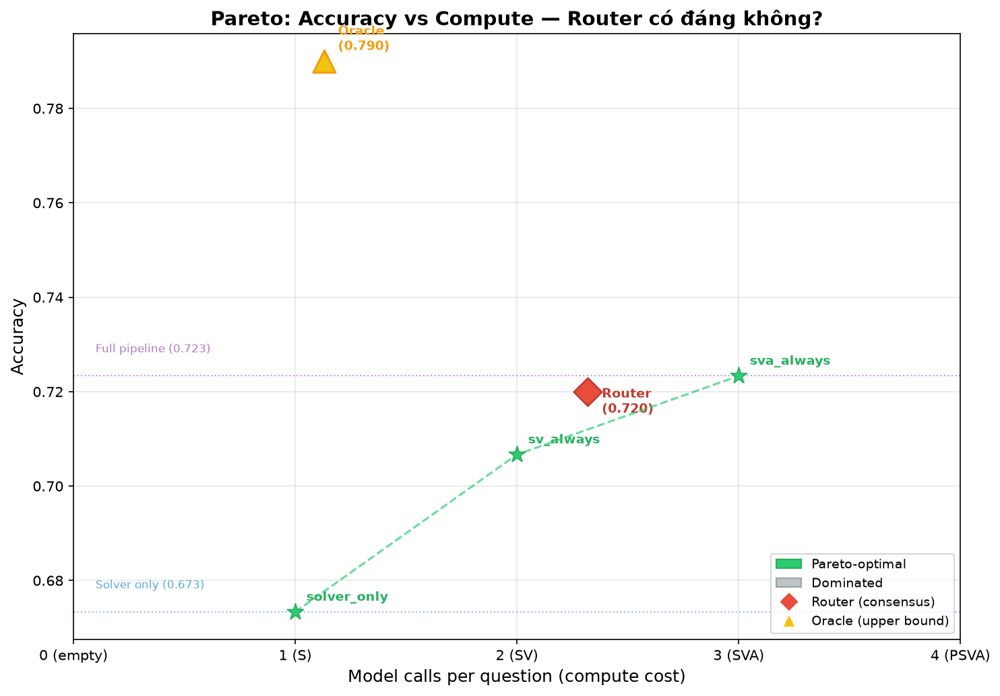

# Efficiency — Coordination có đáng compute không?

> **RQ4:** Tận dụng biến thiên theo câu để chạy rẻ hơn được không?

Dữ liệu: trace đầy đủ (plan/sol/ver/agg + s_ok/v_ok/a_ok) trên 300 câu, cả GSM8K và MATH,
Qwen2.5-1.5B-Instruct, greedy decode. Phân tích bằng `analysis/router.py` + `analysis/pareto_plot.py`.

⚠️ **Cảnh báo đọc:** Các số liệu dưới đây đo **một lần** ở n=300 (không có 5 fold). Sàn nhiễu
đã cho thấy hiệu ứng < 5 điểm không đáng tin. Các hiệu ứng lớn (Oracle − Solver, Router − Solver
trên GSM8K) vượt ngưỡng nhưng chưa có thanh sai số.

---

## 1. Bảng chính: Accuracy vs Compute

| Chiến lược | GSM8K acc | GSM8K cost/Q | MATH acc | MATH cost/Q | Ghi chú |
|---|---|---|---|---|---|
| **Solver only (S)** | .6733 | 1 | .4133 | 1 | Baseline rẻ nhất |
| S+V (luôn) | .7067 | 2 | .4267 | 2 | Verifier luôn chạy |
| S+V+A (luôn = full) | .7233 | 3 | .3733 | 3 | Aggregator phá trên MATH |
| **Consensus Router** | **.7200** | **2.32** | **.4133** | **2.40** | S+V; bất đồng → A |
| Oracle (trần trên) | .7900 | 1.13 | .4800 | 1.07 | Biết trước câu nào đúng |

*(cost/Q = số lần gọi model trung bình per question)*

### Đọc bảng

**GSM8K:** Router đạt .7200 — ngang full pipeline (.7233) mà chỉ tốn 2.32 thay vì 3 calls/Q
(tiết kiệm 23%). So với Solver đơn, Router lấy **+4.7đ**; Oracle cho biết khoảng trống tối đa
là **+11.7đ**. Router lấy lại **40%** khoảng trống đó.

**MATH:** Router không lấy thêm gì (.4133 = Solver). Lý do: S và V bất đồng nhiều (40% câu)
nhưng A lại **phá nhiều hơn sửa** trên MATH (−6.0đ, đã kiểm 5 fold) → chạy A khi bất đồng chỉ
làm tệ đi. Oracle cho thấy khoảng trống +6.7đ tồn tại nhưng router consensus không khai thác được.

---

## 2. Vì sao router hiệu quả ở GSM8K nhưng vô dụng ở MATH?

### Cơ chế đồng thuận

Router dựa trên một tín hiệu quan sát được **trước khi quyết định chạy A**: Solver và Verifier
có ra cùng đáp án không?

| | GSM8K | MATH |
|---|---|---|
| S, V đồng thuận | 203/300 (67.7%) | 180/300 (60.0%) |
| S, V bất đồng | 97/300 (32.3%) | 120/300 (40.0%) |
| Khi đồng thuận → S đúng | 95.1% | 88.3% |
| Khi bất đồng → A cứu được | 45.4% | 25.0% |

**GSM8K:** Khi S và V đồng thuận, S đúng 95% → không cần A, tiết kiệm 1 call. Khi bất đồng
(32% câu), A chọn đúng 45% → vẫn có ích. Tổng hợp: router giữ gần đủ accuracy full pipeline
mà giảm 23% cost.

**MATH:** Đồng thuận ít hơn (60% vs 68%) và khi bất đồng, A chỉ cứu 25% (so 45% ở GSM8K).
Hơn nữa, A phá nhiều trên MATH (−6.0đ đã xác nhận) → chạy A khi bất đồng = **đổ thêm tiền
để làm tệ đi**. Router consensus không đủ thông tin để quyết định *tốt hơn* A.

### Tương tác vai trò (interaction effects)

| Cặp vai trò | GSM8K | MATH |
|---|---|---|
| S−V | −0.265 | −0.219 |
| S−A | −0.256 | −0.210 |
| V−A | −0.256 | −0.210 |

Tương tác âm mạnh giữa S/V/A nghĩa là **ba vai này thay thế nhau** nhiều hơn bổ sung nhau.
Trên MATH, A và V gần như trùng lặp (cùng .436 accuracy khi đứng một mình) → chạy cả hai
là lãng phí. Router consensus phát hiện điều này ở GSM8K (skip A khi đồng thuận) nhưng không
cứu được ở MATH (A không đủ thông tin để phân xử khi S và V bất đồng).

---

## 3. Đường Pareto: 16 tổ hợp + Router + Oracle



**Trục X:** #model-calls per question (1 = chỉ Solver, 2 = S+V, 3 = S+V+A, 4 = full PSVA).
**Trục Y:** Accuracy.

Quan sát từ đường Pareto:

1. **Solver một mình (cost=1) nằm trên Pareto frontier** ở cả hai task — không có tổ hợp
   nào rẻ hơn mà đúng hơn. Đây là baseline không thể bỏ qua.

2. **Full pipeline (cost=3–4) KHÔNG nằm trên frontier ở MATH** — nó bị dominated bởi
   tổ hợp chỉ S (cost=1, acc=.436 > full .373). Trên MATH, chạy đầy đủ pipeline tốn nhiều
   hơn mà ra kém hơn.

3. **Oracle (cost≈1.1) gần như miễn phí** — nó đạt accuracy cao nhất ở cost thấp nhất.
   Đây là tín hiệu mạnh: **biến thiên theo câu là có thật**, và nếu có bộ định tuyến
   hoàn hảo, ta không cần chạy toàn bộ pipeline. Khoảng trống Oracle − Solver là +11.7đ
   (GSM8K) và +6.7đ (MATH).

4. **Router nằm giữa** Solver và Oracle trên trục accuracy, nhưng cost trung bình cao hơn
   Oracle (2.32 vs 1.13 ở GSM8K) — router không tối ưu hoàn hảo nhưng là xấp xỉ thực tế
   được của Oracle.

---

## 4. Hiệu quả theo token (không chỉ theo lần gọi)

Cost tính theo "số lần gọi model" che giấu một yếu tố quan trọng: **mỗi vai tốn số token
khác nhau**. Trên MATH 1.5B:

| Vai trò | Median ký tự output |
|---|---|
| Planner | 873 |
| Solver | 986 |
| Verifier | 1,087 |
| Aggregator | 142 |

Verifier tốn **gấp 5 lần** Aggregator về output. Nếu tính theo token:

| Chiến lược | Ước lượng token/Q (output) | GSM8K acc |
|---|---|---|
| Solver only | ~250 (18 ký tự median) | .6733 |
| S+V | ~830 (18 + 577 + overhead) | .7067 |
| S+V+A | ~850 (thêm 142 ký tự A) | .7233 |

Aggregator rất rẻ (142 ký tự median) nhưng lại là vai gây hại trên MATH. Ngược lại,
Verifier đắt (1,087 ký tự) nhưng sinh giá trị trên GSM8K. **Cost-per-fix** của Verifier
trên GSM8K: 32 fix / (300 × 577 ký tự) ≈ 1 fix / 5,400 ký tự output.

### So sánh với phương án bất đối xứng (1.5B giải + 7B soát)

Dữ liệu từ 5 fold (bs_g, bs_m):

| | GSM8K | MATH |
|---|---|---|
| S1.5B+V7B accuracy | .810 | .563 |
| S7B accuracy | .910 | .593 |
| S7B+V7B accuracy | .900 | .670 |
| Token (S1.5B+V7B) | 105k | 119k |
| Token (S7B) | 120k | 152k |
| Token (S7B+V7B) | 205k | 261k |
| **S1.5B+V7B / S7B** | **0.88×** | **0.78×** |

Phương án 1.5B+V7B tốn ít token hơn S7B (0.78–0.88×) nhưng accuracy thấp hơn 10–3 điểm.
Trên MATH, nó ngang bằng thống kê với S7B (khoảng chứa 0) mà rẻ hơn 22% → **là lựa chọn
chi phí hợp lệ ở giữa dải độ khó** (xem Results mục 0, quy tắc 1).

---

## 5. Router có lấy lại được bao nhiêu của "khoảng trống +11.7đ"?

| | GSM8K | MATH |
|---|---|---|
| Solver (baseline) | .6733 | .4133 |
| Full pipeline | .7233 (+5.0đ) | .3733 (−4.0đ) |
| **Router** | **.7200 (+4.7đ)** | **.4133 (±0.0đ)** |
| Oracle | .7900 (+11.7đ) | .4800 (+6.7đ) |
| Router / Oracle gap | **40%** | **0%** |

**GSM8K:** Router lấy lại 40% khoảng trống Oracle, với 77% cost của full pipeline.
Full pipeline lấy lại 43% — router gần như ngangFull pipeline khi tính theo "điểm mua được
per call", nhưng rẻ hơn.

**MATH:** Router không lấy lại gì. Khoảng trống Oracle +6.7đ tồn tại nhưng không thể khai
thác bằng tín hiệu đồng thuận S−V. Cần tín hiệu giàu hơn (độ tin cậy của Solver, độ khó
câu hỏi, số bước) để router có cơ hội.

---

## 6. Kết luận RQ4

> **Tận dụng biến thiên theo câu để chạy rẻ hơn: CÓ, nhưng chỉ ở task dễ và khi A có ích.**

1. **Khoảng trống thật tồn tại:** Oracle高出 Solver +11.7đ (GSM8K) và +6.7đ (MATH) —
   biến thiên theo câu là có thật, không phải nhiễu.

2. **Router consensus khai thác được 40% khoảng trống ở GSM8K**, với cost 2.32/Q (tiết kiệm
   23% so full pipeline). Ở MATH, router vô dụng vì Aggregator phá nhiều hơn sửa.

3. **Full pipeline KHÔNG nằm trên Pareto frontier ở MATH** — tốn nhiều nhất mà ra kém hơn
   Solver đơn. Trên MATH, coordination bằng 1.5B không đáng compute.

4. **Phương án chi phí tốt nhất ở giữa dải độ khó:** 1.5B giải + 7B soát (asymmetric) —
   ngang S7B trên MATH (p > 0.05) mà rẻ 22% token. Đây là điểm trên Pareto frontier mà
   không cấu hình đồng cỡ nào đạt được.

5. **Hạn chế:** Tất cả số liệu router đo **một lần** (n=300, không 5 fold). Các hiệu ứng
   +4.7đ (router GSM8K) và +11.7đ (oracle GSM8K) vượt ngưỡng nhiễu 5đ nhưng chưa có thanh
   sai số. Cần kiểm lại bằng 5 fold để xác nhận.

---

## Phụ lục: Cách tái lập

```bash
cd shapley

# Chạy router trên trace data (GSM8K hoặc MATH)
TRACE=res_ft_g15 python analysis/router.py    # GSM8K
TRACE=res_ft_m15 python analysis/router.py    # MATH

# Vẽ đồ thị Pareto
python analysis/pareto_plot.py

# Chạy test suite (37 tests)
python -m pytest tests/test_router.py -v
```

Dữ liệu đầu vào: `res_ft_*/traces_full.json` — mỗi câu có `s_ok`, `v_ok`, `a_ok`, `sa`, `va`,
`aa` (đáp án của từng vai) và `len_*` (độ dài output). Router so sánh `sa` vs `va` để quyết
định đồng thuận; oracle chọn vai rẻ nhất đúng (`s_ok → v_ok → a_ok`).

Code: `analysis/router.py` (CoalitionData, Oracle, ConsensusRouter, ParetoAnalyzer) +
`analysis/pareto_plot.py` (visualization). Test: `tests/test_router.py` (37 cases, TDD).
